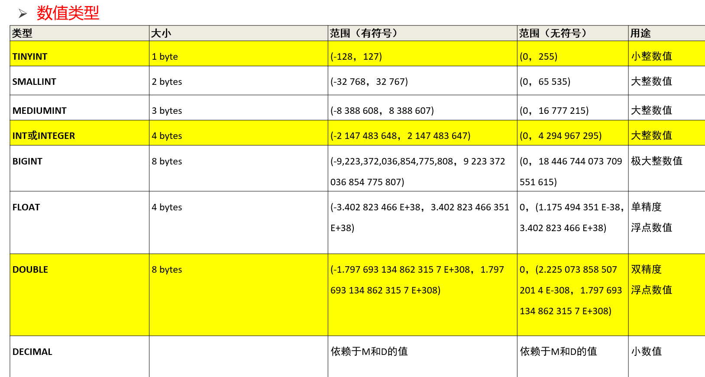

## SQL语法特点：
1、对关键字的大小写不敏感；
2、SQL语句可以以单行或者多行书写，以分号结束；
3、SQL注释：
	-- 单行注， -- 后面一定要加一个空格；
        # 单行注释， #后面可加可不加空格
	/*
	多行注释
	*/ 


## 解压安装MySQL后需要执行的操作：
使用管理员权限进入DOS，在cmd中，进入解压目录下的bin目录依次执行以下命令：
①对mysql进行初始化，请注意，这里会生产一个临时密码，后边要使用这个临时密码
	mysqld --initialize --user=mysql --console
②安装mysql服务
	mysqld --install
③启动mysql服务
	net start mysql
④登录mysql，这里需要使用之前生产的临时密码
	mysql -uroot –p
⑤修改root用户密码
	ALTER USER 'root'@'localhost' IDENTIFIED WITH mysql_native_password BY '123456';
⑤修改root用户权限
	create user 'root'@'%' IDENTIFIED WITH mysql_native_password BY ‘123456';


## MySQL的卸载
1:停止服务:
	方式1: 打开DOS,使用net stop mysql命令
	方式2: 【win+R快捷键】 -- 》输入 services.msc -- 》进入服务窗口关闭mysql服务;
2:卸载程序(可选):
	使用360卸载mysql程序或【控制面板】》【程序和功能】》右键卸载程序 ;
3:删除项目根文件夹:
	进入mysql安装位置, 删除mysql的解压文件夹;
4:删除C盘隐藏文件夹(可选):
	显示隐藏文件后, 删除C盘下的“C:\ProgramData\MySQL”所有文件;
5:删除注册表信息:
	【win+R快捷鍵】》输入regedit命令打开注册表窗口, 删除以下文件:
	HKEY_LOCAL_MACHINE/SYSTEM/ControlSet001/Services/Eventlog/Applications/MySQL
	HKEY_LOCAL_MACHINE/SYSTEM/ControlSet002/Services/Eventlog/Applications/MySQL
	HKEY_LOCAL_MACHINE/SYSTEM/CurrentControlSet/Services/Eventlog/Applications/MySQL
6:删除环境变量里的配置:
	如果有更改了环境变量, 那么进入【计算机】》右键【属性】》【高级系统设置】》【环境变量】》删除系统变量中的MYSQL_HOME变量和删除Path变量
	中的mysql路径;
7:删除MYSQL服务
	管理员权限cmd -- 》sc delete MySQL服务名字

## MySQL数据库基本操作
### MySQL数据库基本操作-DDL
#### 对数据库的常用操作
| 功能             | 	SQL                                                    |
|:---------------|:--------------------------------------------------------|
| 查看所有的数据库       | show databases;                                         |		
| 创建数据库          | create database [if not exists] mydb1 [chartset=utf8];  |
| 切换(选择要操作的)数据库  | use mydb1;                                              |
| 删除数据库          | 				drop database [if exists] mydb1;                    |
| 修改数据库编码        | 	alter database mydb1 character set utf8;               |
#### 对表结构的常用操作-创建表
```
create table [if not exists] (
	字段名1 类型[(宽度)] [约束条件] [comment '字段说明'],
	字段名2 类型[(宽度)][约束条件] [comment '字段说明'],
	字段名3 类型[(宽度)] [约束条件] [comment '字段说明'],
) [表的一些设置];
```
创建表是构建一张空表, 指定这个表的名字, 这个表有几列, 每一列叫什么名字, 以及每一列存储的数据类型。
```mysql
use mydb1;
create table if not exists student
(
	sid	    int,
	name    varchar(20),
	gender  varchar(20),
	age     int,
	birth   date,
	address varchar(20),
	score   double
);
```

#### 数据类型
##### 数值类型

##### 字符串类型

##### 日期类型


#### 对表结构的常用操作-其他操作
| 功能            | SQL                   |
|:--------------|:----------------------|
| 查看当前数据库的所有表名称 | show tables;          |
| 查看指定某个表的创建语句  | show create table 表名; |
| 查看表结构         | desc 表名；              |
| 删除表           | drop table 表名;        |

#### 对结构的常用操作-修改表结构格式
##### 修改表添加列
	alter table 表名 add 列名 类型(长度)[约束];
	示例:
	#为 student 表添加一个新的字段为: 系别 dept 类型为 varchar(20)
	alter table student add `dept` varchar(20);
##### 修改列名和类型
	alter table 表名 change 旧列名 新列名 类型(长度) 约束;
	示例:
	#将 student 表的 dept 字段更换为 department varchar(30)
	alter table student change `dept` department varchar(30);
##### 修改表删除列
	alter table 表名 drop 列名;
	示例:
	alter table student drop department;
##### 修改表名
	rename table 表名 to 新表名;
	示例:
	rename table `student` to stu;

### MySQL数据库基本操作-DDL
#### 数据插入
	insert into 表(列名1, 列名2, 列名3...) values(值1, 值2, 值3...), (值1, 值2, 值3...);
	insert into 表 values(值1, 值2, 值3...), (值1, 值2, 值3...);
	insert into 表 values(值1, 值2, 值3...);
	示例:

### MySQL数据库基本操作-DDL
#### 数据插入
	insert into 表(列名1, 列名2, 列名3...) values(值1, 值2, 值3...), (值1, 值2, 值3...);
	insert into 表 values(值1, 值2, 值3...), (值1, 值2, 值3...);
	insert into 表 values(值1, 值2, 值3...);
	示例:
	insert into student(sid, name, gender, age, birth, address, score) 
	values(1001, '男', 18, '1996-12-23', '北京', 83.5);
	insert into student values(1001, '男', '1996-12-23', '北京', 83.5);
#### 数据修改
	update 表名 set 字段名=值, 字段名=值...;
	update 
####

提交测试


	